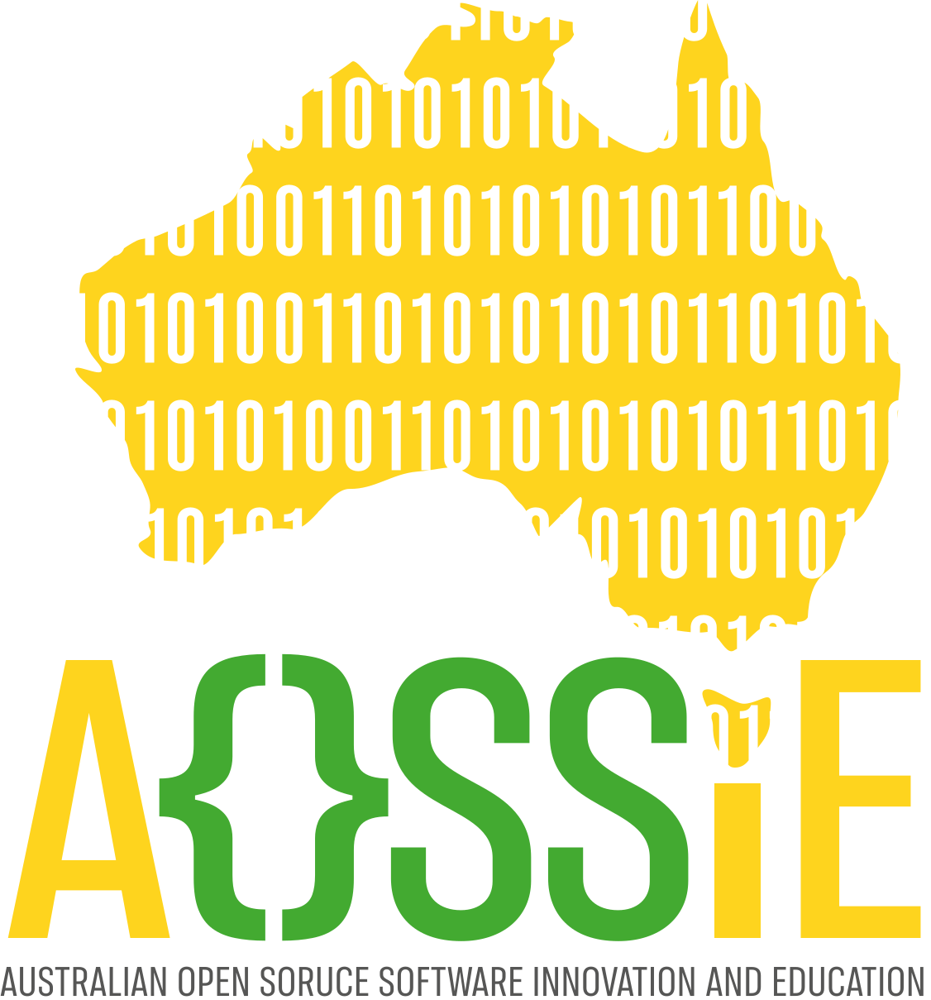

<!-- Don't delete it -->
<div name="readme-top"></div>

<!-- Organization Logo -->
<div align="center" style="display: flex; align-items: center; justify-content: center; gap: 16px;">
  

</div>

&nbsp;

<!-- Organization Name -->
<div align="center">

[](https://aossie.org/)

</div>

<!-- Organization/Project Social Handles -->
<p align="center">
  <a href="https://t.me/+bMWGzaMTMa8xN2Ex">
    
  </a>
  &nbsp;
  <a href="https://x.com/aossie_org">
    
  </a>
  &nbsp;
  <a href="https://discord.gg/hjUhu33uAn">
    
  </a>
  &nbsp;
  <a href="https://discord.gg/YzDKeEfWtS">
    
  </a>
  &nbsp;
  <a href="https://www.linkedin.com/company/aossie/">
    
  </a>
  &nbsp;
  <a href="https://www.youtube.com/@AOSSIE-Org">
    
  </a>
  &nbsp;
  <a href="https://scorecard.dev/viewer/?uri=github.com/AOSSIE-Org/website">
    
  </a>
  &nbsp;
  <a href="https://www.youtube.com/@StabilityNexus">
    
  </a>
</p>


---

<div align="center">
<h1>AOSSIE's Website</h1>
</div>

This repository contains the assets required to build **AOSSIE's Website**. We're glad that you want to contribute! Contributions to the project are very much welcomed! Please reach out with ideas for new content or issues with existing content!

The website is built on **Next.js 16 (App Router)**, **React 19**, **Tailwind CSS v4**, and pre-configured for **Internationalization (i18n)** and **Localization (l10n)** using **next-intl**.

---

## 🚀 Features

- **Multi-lingual Support (i18n):** Deeply integrated multi-language support powered by `next-intl`.
- **Dual Theme System:** Light, Dark, and System mode support with zero flash on load.
- **Modern Responsive Design:** Crafted with Tailwind CSS v4 and smooth scrolling via Lenis.
- **High Performance:** Built with Next.js 16 App Router and React 19 for speed and SEO.

---

## 💻 Tech Stack

- **Framework:** Next.js 16.2.11 (App Router, Turbopack)
- **Library:** React 19
- **Styling:** Tailwind CSS v4 & PostCSS
- **Internationalization:** `next-intl`
- **Theme Manager:** `next-themes`

---

## 📋 Project Maturity & TODO Checklist

In the checklist below, mark the items that have been completed for your project:

* [x] The project has a logo (`public/brand/icons/aossie_logo.svg`).
* [x] The project has a favicon (`public/brand/icons/favicon.ico`).
* [x] The web frontend:
   - [x] Has proper title and metadata.
   - [x] Has proper open graph metadata, to ensure that it is shown well when shared in social media.
   - [x] Has a footer and header with AOSSIE logos and social handles.
   - [x] Uses React Server Components by default, introducing Client Components (`"use client"`) only when interactivity or client hooks are required.
   - [x] Is deployed to GitHub Pages via a GitHub Workflow (`.github/workflows/nextjs.yml`).
   - [x] Has automated CI build and lint validation (`.github/workflows/ci.yml`).
   - [x] Has CodeRabbit automated AI code review (`.coderabbit.yml`).
   - [x] Has open-source legal compliance (`DCO.md`, `COPYRIGHT.md`, `Contributors.md`).

---

## 🚀 Key Features

- **Next.js 16 & React 19:** Utilizing the latest Server Components, Client Actions, and async routing paradigms.
- **Tailwind CSS v4:** Modern utility-first styling with native CSS variables and streamlined postcss integrations.
- **Dual Theme System:** Flash-free light, dark, and system preferred themes using `next-themes` and Tailwind CSS v4 custom variants.
- **Robust i18n & l10n:** Deeply integrated multi-language support:
  - Automatic locale detection based on browser preferences.
  - Subpath routing (e.g., `/en`, `/hi`) with clean `as-needed` URL prefixing.
  - Sleek, interactive language switcher client component.
  - Zero-bundle-size footprint for static translations using Server Components & Client `useTranslations`.
- **Developer Experience:** Strict TypeScript compilation and ES Lint setup.
- **Application Control Compatibility:** Configured with manual Webpack & Turbopack alias resolution to bypass restrictive execution environments blocking native binary compiles.
- **Open-Source Governance & CI/CD:** Integrated GitHub Actions workflows (`ci.yml`, `nextjs.yml`, `label-merge-conflicts.yml`), `.coderabbit.yml`, and `DCO.md` legal documentation.
- **AI Agent Pairing Ready:** Includes `AGENTS.md` and `CLAUDE.md` to guide AI development agents.

---

## 📂 Project Structure

Here is a breakdown of the key i18n directories and files:

```text
├── .github/
│   └── workflows/          # GitHub Actions (CI, GitHub Pages deployment, merge conflict checks)
├── next.config.ts          # Alias-wrapped Next configuration
├── public/                 # Static assets, robots.txt, assetlinks.json, llms.txt
│   ├── .well-known/
│   ├── llms.txt
│   ├── robots.txt
│   └── brand/
│       ├── Brand.md            # Official AOSSIE brand guidelines document
│       └── icons/             
│           ├── aossie_logo.svg              # AOSSIE Vector logo
│           ├── stability_nexus_logo.svg     # Vector logo
│           └── favicon.ico                  # Browser tab icon
├── src/
│   ├── config/
│   │   └── languages.ts        # Central registry of supported languages & locales
│   ├── i18n/
│   │   ├── routing.ts          # Core i18n routing parameters (locales, defaults)
│   │   ├── request.ts          # Server-side translation dictionary loading configuration
│   │   ├── metadata.ts         # Configuration data, SEO values, or reflection data for a project
│   │   └── navigation.ts       # Type-safe navigation helpers (Link, useRouter, etc.)
│   ├── messages/
│   │   ├── en.json             # English translation dictionary
│   │   └── hi.json             # Hindi translation dictionary
│   ├── app/
│   │   ├── sitemap.ts          # Dynamically generated localized sitemaps
│   │   └── [locale]/           # Localized route group
│   │       ├── layout.tsx      # Multi-lingual layout injecting client context & translations
│   │       ├── page.tsx        # Localized Landing Page ("use client")
│   │       ├── globals.css     # Global styles for the app segment
│   │       ├── error.tsx       # Localized Error Boundary page fallback
│   │       └── not-found.tsx   # Localized 404 page fallback
│   ├── components/
│   │   ├── LanguageSwitcher.tsx # Dropdown element to switch interface locales interactively
│   │   ├── ThemeToggle.tsx      # Multi-state theme switch with micro-animations
│   │   └── providers/
│   │       ├── theme-provider.tsx # Next-themes client wrapper component
│   │       └── lenis-provider.tsx # Lenis smooth scrolling provider wrapper
├── .coderabbit.yml         # Automated AI Code Review configuration
├── COPYRIGHT.md            # Copyright terms
├── Contributors.md         # Project contributors list
└── DCO.md                  # Developer Certificate of Origin
```

---

## 🛠️ Usage Guide

### 1. Adding a New Language

To add support for a new language (e.g., French - `fr`):

1. **Register the language:** Open [`src/config/languages.ts`](src/config/languages.ts) and add your new language to the `languages` array:
   ```typescript
   export const languages: Language[] = [
     { code: 'en', name: 'English', localName: 'English' },
     { code: 'hi', name: 'Hindi', localName: 'हिन्दी' },
     { code: 'fr', name: 'French', localName: 'Français' } // Add this line
   ];
   ```

2. **Create the translation catalog:** Under `src/messages/`, create a new file named `fr.json`:
   ```json
   {
     "Home": {
       "heading": "Bienvenue sur AOSSIE Webpage"
     }
   }
   ```

3. That's it! Next.js and `next-intl` will automatically register the locale, add it to the routing tables, and handle redirection for visitors matching `fr` browser preferences.

---

### 2. Translating Text in Pages and Components

#### Server Components (Recommended for Static Content)
By default, server components can load translations statically without shipping translation JSONs to the client bundle:

```tsx
import { useTranslations } from 'next-intl';

export default function Section() {
  const t = useTranslations('Home');
  return <h1>{t('heading')}</h1>;
}
```

#### Client Components
If your component uses React hooks (e.g., `useState`), define it with `"use client"` and import from `next-intl`:

```tsx
"use client";

import { useTranslations } from 'next-intl';

export default function InteractiveButton() {
  const t = useTranslations('Home');
  return <button onClick={() => alert('Clicked!')}>{t('heading')}</button>;
}
```

---

### 3. Navigation Helpers

When navigating between routes, always use the locale-aware navigation helpers imported from [`src/i18n/navigation.ts`](src/i18n/navigation.ts) instead of standard `next/link` or `next/navigation`:

```tsx
import { Link } from '@/i18n/navigation';

// Will automatically resolve to /en/about or /hi/about based on active locale
<Link href="/about">About Us</Link>
```

For programmatic router navigation:
```typescript
import { useRouter, usePathname } from '@/i18n/navigation';

const router = useRouter();
const pathname = usePathname();

// Switch active locale on current page
router.replace(pathname, { locale: 'hi' });
```

---

### 4. Theme Configuration & Dual Theme Support

The starter kit uses `next-themes` combined with Tailwind CSS v4's class-based custom variants to provide a responsive and flash-free theme experience.

#### Customizing Colors
Tailwind v4 is configured via CSS custom properties in [`src/app/[locale]/globals.css`](src/app/[locale]/globals.css). To adjust the default light and dark theme background or text colors, edit the root variables:

```css
:root {
  --background: #ffffff; /* Light theme background */
  --foreground: #121212; /* Light theme text */
}

.dark {
  --background: #0a0a0a; /* Dark theme background */
  --foreground: #f4f4f5; /* Dark theme text */
}
```

#### Using Theme Classes
To create element styles that adapt automatically to the user's selected theme, use semantic utility tokens instead of inline `dark:` utilities:

```tsx
<div className="bg-background-secondary text-foreground-primary border border-border-default">
  This card automatically transitions colors across light and dark themes.
</div>
```

---

### 5. Smooth Scrolling (Lenis)

The starter repository integrates the `lenis` library to provide smooth, high-performance inertial scrolling across all browsers.

#### Customizing Lenis Options
To configure scroll parameters (e.g., dampening velocity, custom scroll durations, or scroll directions), update the parameters passed to the `ReactLenis` component in [`lenis-provider.tsx`](src/components/providers/lenis-provider.tsx):

```tsx
<ReactLenis root options={{ lerp: 0.1, duration: 1.5, smoothWheel: true }}>
  {children}
</ReactLenis>
```

To access the active Lenis instance or bind custom scroll animations programmatically in your page components, use the `useLenis` hook:

```typescript
import { useLenis } from 'lenis/react';

const lenis = useLenis(({ scroll, limit, velocity, direction }) => {
  // Bind your scroll logic or animation timelines here
});
```

---

## ⚡ Development and Deployment

### Getting Started

Install the project dependencies:
```bash
npm install
```

Start the development server:
```bash
npm run dev
```

Open [http://localhost:3000](http://localhost:3000) to view it. The application will automatically detect your browser's language preferences and route you to `/en` or `/hi` (or fall back to the default language, English).

### Building for Production

Compile and optimize the project:
```bash
npm run build
```

This compiles optimized static pages under the `/[locale]` path and checks all TypeScript configurations.

### Running in Production

Start the optimized server:
```bash
npm run start
```

---

## ⚙️ Initial Project Setup Checklist

When bootstrapping a new project from this starter repository, update the following configurations to align with your project's branding, package naming, and hosting domains:

### 1. Project Identity & Header Details
- **Project Title & Logo ([`README.md`](README.md))**: Update the main project header logo (`public/brand/icons/aossie_logo.svg`), title `<h1>AOSSIE's Website</h1>`, project description, feature list, and tech stack.
- **AI Agent Context ([`AGENTS.md`](AGENTS.md))**: Update directives and rules for AI coding agents.
- **LLM Manifest ([`public/llms.txt`](public/llms.txt))**: Update the root LLM crawler policy.
- **Community & Social Links ([`Contributors.md`](Contributors.md))**: Update Discord and community links.

### 2. Domain Names & Search Engine Crawlers
- **Sitemap Generator ([`src/app/sitemap.ts`](src/app/sitemap.ts))**: Set the default fallback domain `https://aossie.org` or set the `NEXT_PUBLIC_SITE_URL` environment variable in your production hosting panel.
- **Search Crawler Rules ([`public/robots.txt`](public/robots.txt))**: Point to your production sitemap URL (`https://aossie.org/sitemap.xml`).

### 3. Branding Guidelines & Assets
- **Logo & Favicons ([`public/brand/icons/`](public/brand/icons/))**: Maintain official organization logos (`aossie_logo.svg` and `favicon.ico`).
- **Brand Documentation ([`public/brand/Brand.md`](public/brand/Brand.md))**: Document custom color hex codes, typography selections, and asset paths to guide developers and AI coding agents.

### 4. SEO & i18n Localization Metadata
- **Schema.org JSON-LD ([`src/app/[locale]/page.tsx`](src/app/[locale]/page.tsx))**: Locate the `jsonLd` object inside the `Home` component and update `publisher.name`, `publisher.url`, and `publisher.logo`.
- **Translation Catalogs ([`src/messages/en.json`](src/messages/en.json), [`src/messages/hi.json`](src/messages/hi.json))**: Update the `heading`, `metaTitle`, and `metaDescription` keys with localized titles and descriptions.

### 5. Mobile & AI Platform Configurations
- **Android App Links ([`public/.well-known/assetlinks.json`](public/.well-known/assetlinks.json))**: Configure package name and Android application certificate SHA-256 fingerprint if applicable.
- **AI Agent Plugins ([`public/.well-known/ai-plugin.json`](public/.well-known/ai-plugin.json))**: Update host URLs, contact emails, and description text to describe website features to AI agents.
- **LLM Crawler Rules ([`public/llms.txt`](public/llms.txt))**: Serves the root crawlers policy indicating allowed LLM bot indexing.


---

## 🚀 Getting Started

To contribute to this repository you will need to:
1. Fork this repository
2. Push changes to a new branch in your fork
3. Create a pull request from that branch to the main branch of this repository

> [!NOTE]
> Forking only needs to be done once, after which you can push changes to your fork.

---

## 💻 Running the website Locally

In order to run the site locally:
1. Fork the website and clone that fork on your system:
   ```bash
   git clone https://github.com/<YOUR_USERNAME>/website.git
   ```
2. Open a terminal window and change the directory to the cloned repository:
   ```bash
   cd website
   ```
3. In the root directory, install dependencies and start the development server:
   ```bash
   npm install
   npm run dev
   ```
4. The website will be active at [http://localhost:3000](http://localhost:3000/).

---

## 🤝 Contributing

Contributions to the project are very much welcomed! Please reach out with ideas for new content or issues with existing content.

You can contribute by:
- Raising any issues you find
- Fixing issues by opening Pull Requests
- Improving the website
- Talking about AOSSIE

If you want to get in touch with us first before contributing, join our community:
- **Discord:** [AOSSIE Discord Channel](https://discord.gg/hjUhu33uAn)

---

## 📄 License

This project is licensed under the [MIT License](https://choosealicense.com/licenses/mit/).

